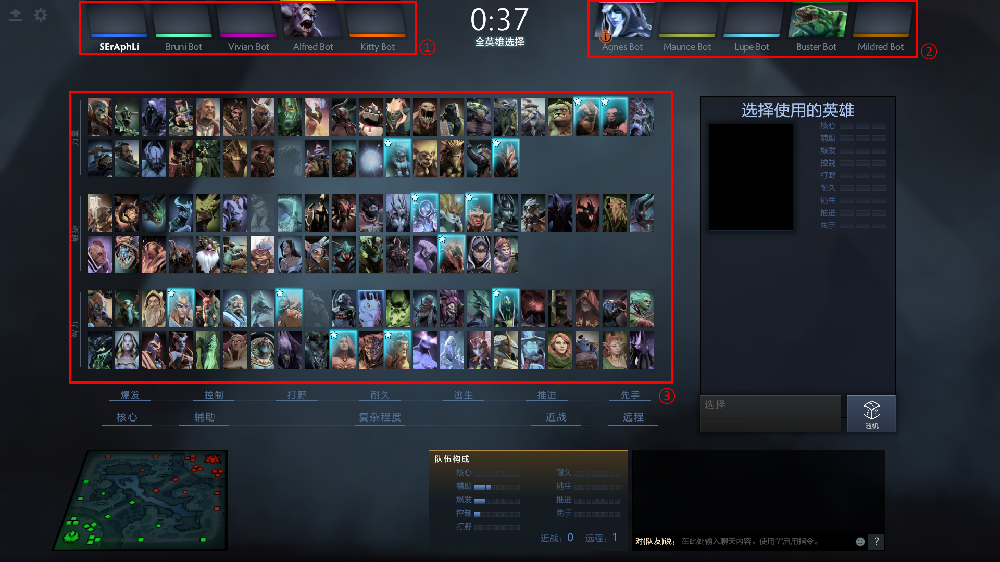
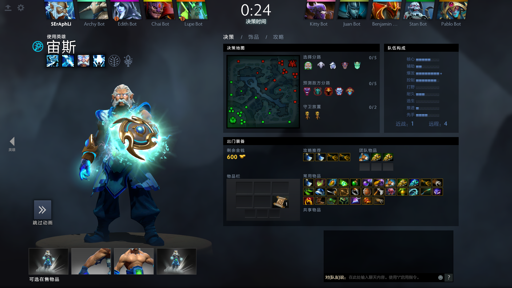
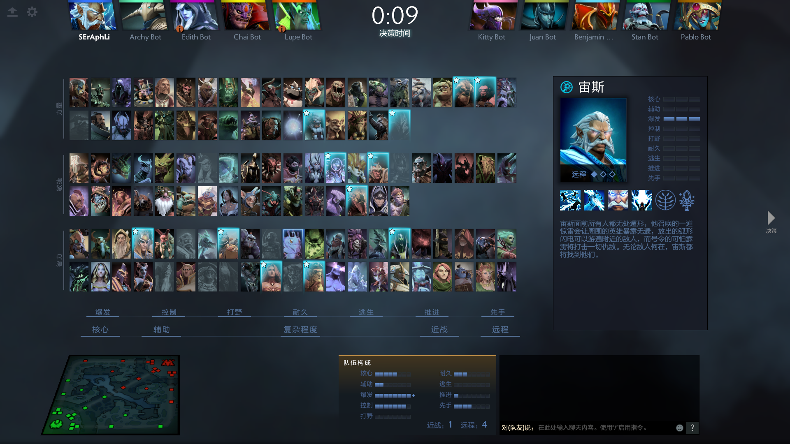

# 自制DotaPlus的使用说明

软件的原理是通过图像识别来确定英雄界面中可用的英雄和双方的英雄.

## 使用方式

1. 双击`dotaplus_desktop.exe`打开软件
2. 在英雄选择界面按键盘上的`Print Screen`截屏
3. 切换到软件然后点击预测

在双方英雄不全的时候点击预测会给出推荐的英雄, 当阵容全选完了的时候会给出阵容的胜率和易发挥的英雄.

## 截图需注意

图1

一个可以被识别的截屏需要完整保留这3部分的图像(如图1), 截屏的时候鼠标不要在这三个区域里面才可以. 程序会自动识别双方阵容还有可选的英雄. 如果选择完英雄自动跳转到了下面这个界面(如图2), 如果还需要预测胜率, 请切换到英雄界面(如图3)截屏.

